# <!-- fit --> A11y | Accessibility

https://www.w3.org/standards/webdesign/accessibility

---

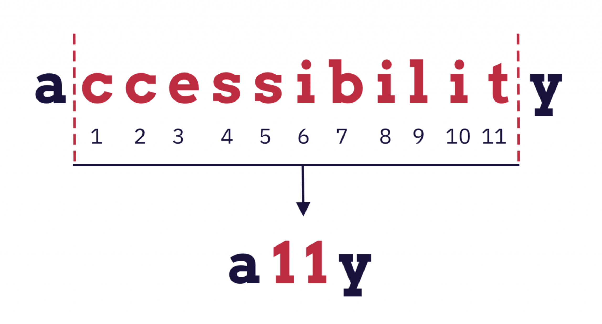

---

# <!-- fit --> Why does Accessibility matter?

---

# Types of disabilities

* permanent
* temporary
* situational
* *congenital*
* *acquired*

<style scoped>
em {
    color: rebeccapurple;
}
</style>
---

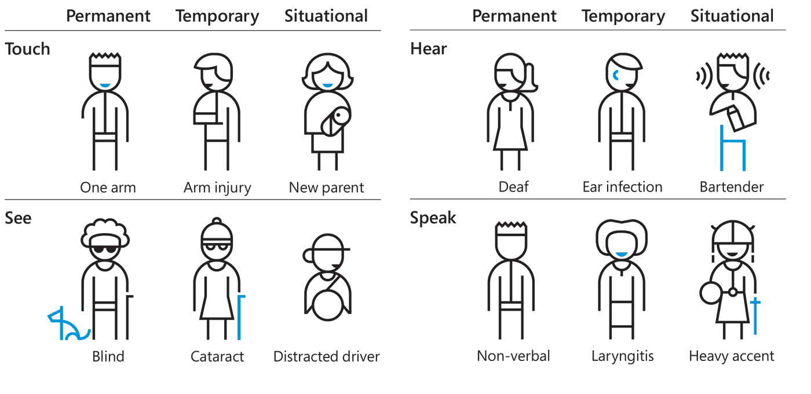

---

# Permanent disability

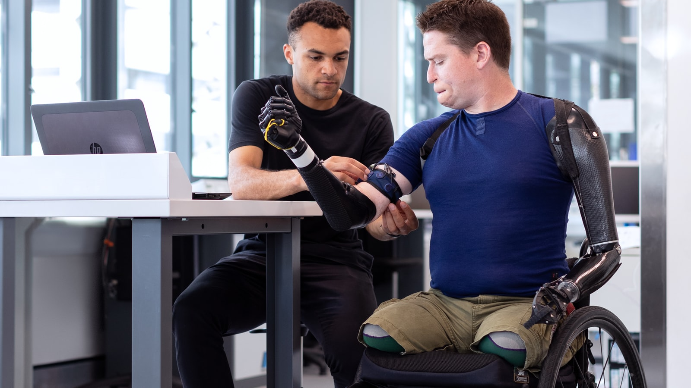

<style scoped>
h1 {
    color: #fff;
    text-shadow: 2px 2px black, -2px 2px black, 2px -2px black, -2px -2px black;
}
</style>

---

# Temporary disability


<style scoped>
h1 {
    color: #fff;
    text-shadow: 2px 2px black, -2px 2px black, 2px -2px black, -2px -2px black;
}
</style>

---

# Situational disability


<style scoped>
h1 {
    color: #fff;
    text-shadow: 2px 2px black, -2px 2px black, 2px -2px black, -2px -2px black;
}
</style>

---

# Make your product accessible

---

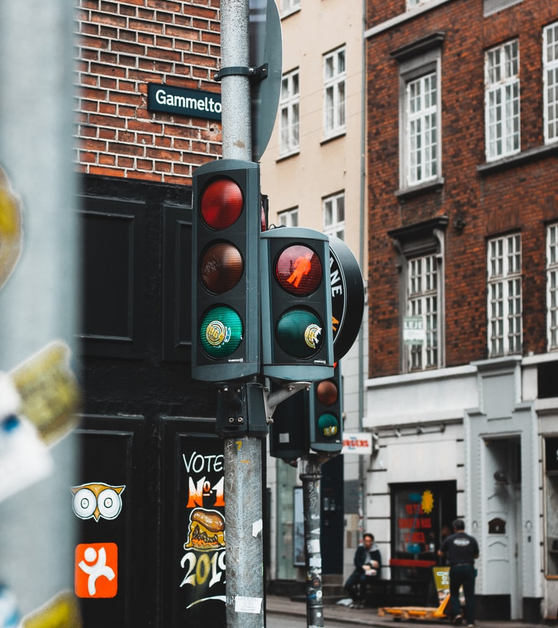
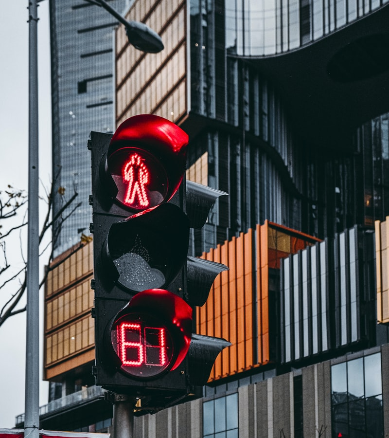

---

# Inclusive Design

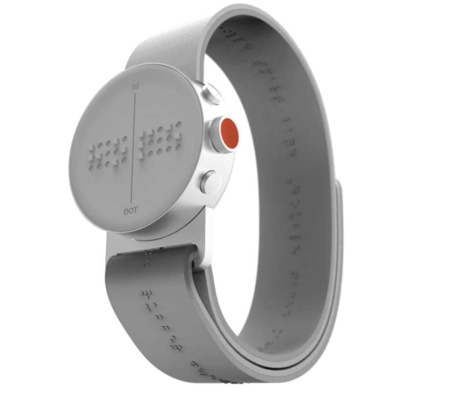

<style scoped>
h1 {
    color: #fff;
    text-shadow: 2px 2px black, -2px 2px black, 2px -2px black, -2px -2px black;
}
</style>

---

> 	The concept of "disability" may have limited the understanding of the need for accessible technology ... the IT industry must consider the wide range of people who could benefit. ”
-Microsoft (2003)

http://www.inclusivedesigntoolkit.com/whatis/whatis.html

---

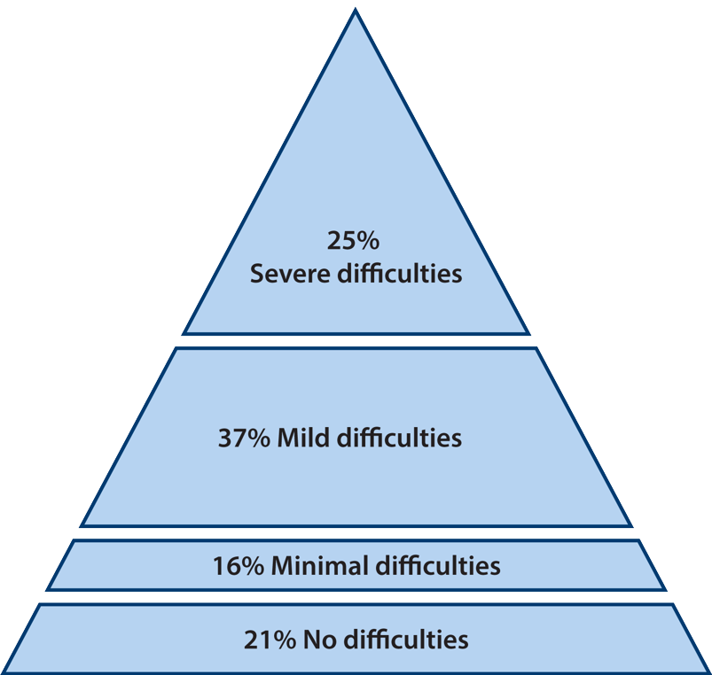

---

## Laws & Policies

https://www.w3.org/WAI/policies/

## Guidelines

https://www.w3.org/TR/WCAG21/

---

# Penalties

> Organizations and businesses can be fined up to **$75,000** for a single ADA violation, raising that fine to **$150,000** for additional violations. This is a pretty large bill for most businesses and can have devastating effects.

## Americans with Disabilities Act

https://www.ada.gov/fed-reg-monetary-penalties.htm

---

# Design for readability
> Readability and legibility are key considerations for all users. For people with disabilities, these attributes can be essential to a successful user experience.

https://accessibility.huit.harvard.edu/design-readability

https://accessibility.huit.harvard.edu/techniques

---

# Simplify your Text

> People with cognitive disabilities or literacy problems may have difficulty reading the complex language of many sites. A translation to simpler language makes it easier for more people to read and understand content.

https://ds.gpii.net/learn/accessibility-masterlist/translate-text-simpler-language

https://simple.wikipedia.org/wiki/Simple_English_Wikipedia


---


# A11y for the Web

## ARIA 

https://www.w3.org/TR/using-aria/

---

# First Rule of ARIA Use

## Don't use ARIA

> If you can use a native HTML element or attribute with the semantics and behavior you require **already built in**, instead of re-purposing an element and adding an ARIA role, state or property to make it accessible, **then do so**.

---

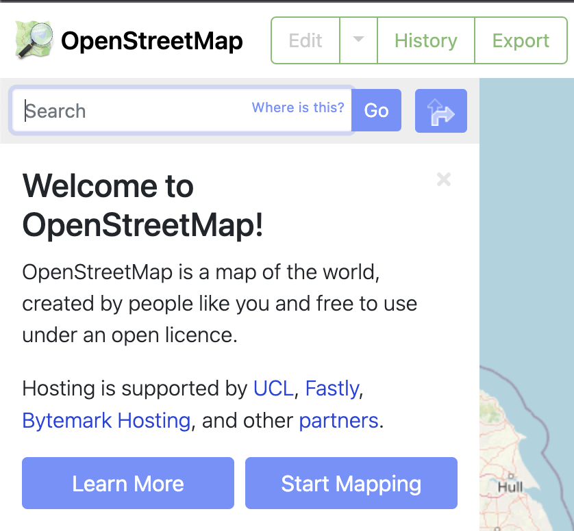
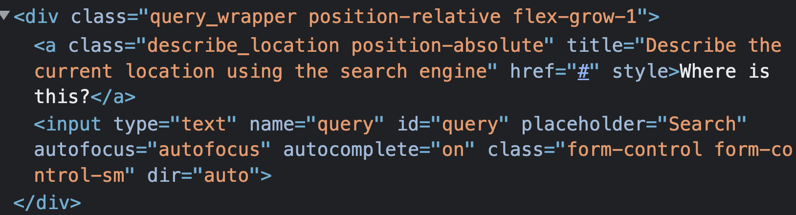

---

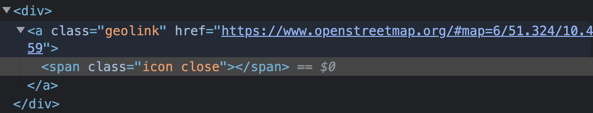
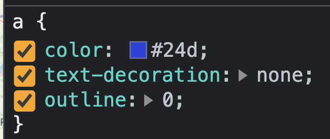

---

# Let's fix the input

```html
<input type="text" aria-label="Search for a place" />
```

---

# Let's fix the button

```html
<button type="button" aria-label="Close this note" >
    <svg viewBox="0 0 24 24" aria-hidden="true">
        <path d="…"/>
    </svg>
</button>
```

---

# I'm no fan of Google, but…

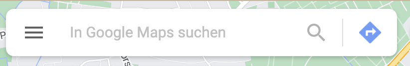

---

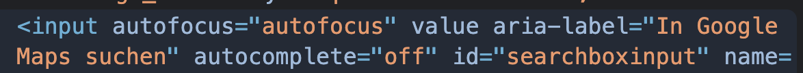
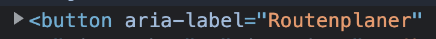

---

# `aria-hidden`
> The `aria-hidden` attribute can be used to hide non-interactive content from the accessibility API.
> …
> Purely decorative content, such as icons or images
> …

---

Don't use Icon Fonts:
https://css-tricks.com/icon-fonts-vs-svg/
https://cloudfour.com/thinks/seriously-dont-use-icon-fonts/

Use Icon Fonts:
https://benfrain.com/seriously-use-icon-fonts/

Icon font to SVG:
https://www.sarasoueidan.com/blog/icon-fonts-to-svg/

---

# What's next?

Let's create internal and external workshops to make the web more accessible and inclusive

---

# <!-- fit --> Thank you